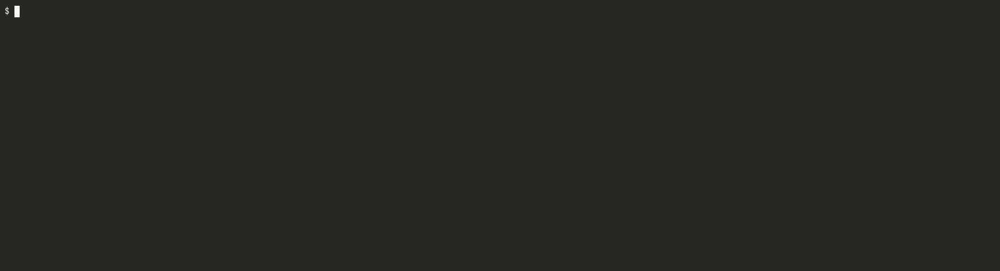

# Exercices in performance optimizations (expo)

> Workshop at GOLAB 2024, 2024-11-11, 14:30, [Martin
> Czygan](martin.czygan@gmail.com),
> [LI](https://de.linkedin.com/in/martin-czygan-58348842)

> [Slides](Slides.md)

### Abstract

The 1 Billion Row Challenge is a simple, data-intensive task, that nonetheless
allows to explore many optimization ideas and techniques in Go.

In this workshop, we start with a baseline implementation and interactively
improve on the solution, learning about benchmarking, different performance
characteristics of standard library types, concurrency patterns, fast data
structures, useful operating system facilities and more.

### Overview

* Benchmarking
    * writing a benchmark
    * running a benchmark
* Profiling
    * cpu profiling
    * generating a flame graph
* 1BRC problem outline
    * problem description
* A baseline implementation

Variations:

* Caring about allocations
    * ReadString
    * Scanner
    * Scanner buffer size
* Faster string parsing
    * splitting a string
    * parsing a float
    * parsing a float with SWAR
* Parallel processing
    * worker pattern
    * splitting the file
* Using memory-mapped files
    * simplifying the api
* Using a custom hash table
    * custom hash table

Benchmarking mechanics

* benchmark small snippets, separately
* basic benchmark with `time`

## Areas of optimization

* buffered I/O
* allocations, e.g. `ReadString` vs `Scanner`
* better buffer sizes, e.g. as passed to `Read(...)`
* parsing a string
* parsing a float as int
* using a memory-mapped file
* parallel processing
* optimal number of batch size and number of workers
* custom hash function

