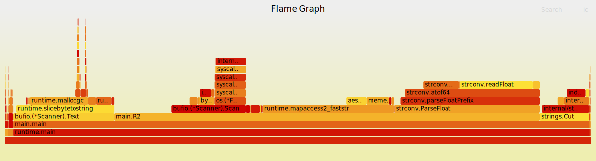

# Intro

Welcome to EXPO! We will explore the [1BRC](https://github.com/gunnarmorling/1brc) with Go.

The 1BRC was a proposed by Gunnar Morling in January 2024, as

> A fun exploration of how quickly 1B rows from a text file can be aggregated with Java

It was meant for Java and ran for a month, but became a topic of larger
interest across various languages. It now has a separate website at
[https://1brc.dev/](http://web.archive.org/web/20241217030337/https://1brc.dev/).

In this workshop, we will learn about:

* measuring and benchmarking Go code
* finding bottlenecks
* apply various optimizations

## Prerequisites

Go 1.18 or later, and git to clone the workshop repository. Most examples run
on all common operating systems. A few examples may run on Linux only.

## The Repo

The repo contains all example code, plus task templates.

```shell
$ git clone git@github.com:miku/expo.git
```

## Outline

1. [Benchmarking](10-Benchmarking.md)
    * writing
    * running a benchmark
2. [Profiling](20-Profiling.md)
    * cpu profiling
    * heap profile
    * generating a flame graph
3. [1BRC problem description](30-1BRC.md)
    * generating sample data with `gen1brcdata`
4. [A baseline implementation](40-Baseline.md)
5. [Reading data](50-Reading.md)
    * ReadString, ReadBytes
    * Scanner
    * Scanner buffer size
6. [Faster string parsing](60-Faster-Strings.md)
    * splitting a string
    * parsing a float
    * parsing a float with SWAR
7. [Parallel processing](70-Parallel-Processing.md)
    * worker pattern
    * splitting the file
8. [Using memory-mapped files](80-Using-mmap.md)
    * simplifying the api
    * [cmd/1brc-050-mmap/](cmd/1brc-050-mmap/)
    * [cmd/1brc-050-mmap](cmd/1brc-050-mmap)
    * [cmd/1brc-060-mmap-float](cmd/1brc-060-mmap-float)
    * [cmd/1brc-060-mmap-int](cmd/1brc-060-mmap-int)
    * [cmd/1brc-070-mmap-int-tweaks](cmd/1brc-070-mmap-int-tweaks)
    * [cmd/1brc-075-mmap-int-extra](cmd/1brc-075-mmap-int-extra)
    * [cmd/1brc-076-mmap-int-za-key](cmd/1brc-076-mmap-int-za-key)
    * [cmd/1brc-080-mmap-int-static-map](cmd/1brc-080-mmap-int-static-map)
    * [cmd/1brc-081-mmap-int-static-map-za-key](cmd/1brc-081-mmap-int-static-map-za-key)
    * [cmd/1brc-082-mmap-faster-int-static-map-za-key](cmd/1brc-082-mmap-faster-int-static-map-za-key)
9. [Using a custom hash table](90-Custom-Map.md)
    * custom hash table
10. Faster semicolon finding
    * [x/findchar/](x/findchar)


## Reference

Flame graphs from various implementations.

```
$ prog -cpuprofile cpu.pprof
$ pprof_to_svg.sh # => cpu.svg
```


### 1brc-000-baseline


### 1brc-001-baseline-read-limitmem


### 1brc-002-plain-scanner


### 1brc-005-baseline-scan


### 1brc-010-baseline-scan-tweak


### 1brc-020-fanout


### 1brc-030-fanout-scanner


### 1brc-040-file-partition


### 1brc-050-mmap


### 1brc-060-mmap-float


### 1brc-060-mmap-int


### 1brc-070-mmap-int-tweaks


### 1brc-075-mmap-int-extra


### 1brc-076-mmap-int-za-key


### 1brc-080-mmap-int-static-map


### 1brc-081-mmap-int-static-map-za-key


### 1brc-401-baseline


### 1brc-402-avoid-double-hashing



### 1brc-403-avoid-parse-float


### 1brc-404-temp-int32


### 1brc-405-avoid-cut


### 1brc-406-no-scanner


### 1brc-407-custom-hash-table


### 1brc-408-parallel-baseline


### 1brc-409-parallel-opt


### 1brc-410-fast-semi


## Timings

From 4m3.894s to 8s (29x).

```
./1brc-410-fast-semi
real    0m8.219s
./1brc-409-parallel-opt
real    0m9.164s
./1brc-408-parallel-baseline
real    1m9.731s
./1brc-407-custom-hash-table
real    0m33.267s
./1brc-406-no-scanner
real    1m2.380s
./1brc-405-avoid-cut
real    1m32.139s
./1brc-404-temp-int32
real    1m43.477s
./1brc-403-avoid-parse-float
real    1m45.715s
./1brc-402-avoid-double-hashing
real    2m18.899s
./1brc-401-baseline
real    2m41.043s
./1brc-081-mmap-int-static-map-za-key
real    0m16.663s
./1brc-080-mmap-int-static-map
real    0m20.360s
./1brc-076-mmap-int-za-key
real    0m20.793s
./1brc-075-mmap-int-extra
real    0m36.159s
./1brc-070-mmap-int-tweaks
real    0m36.920s
./1brc-060-mmap-int
real    0m39.022s
./1brc-060-mmap-float
real    0m45.243s
./1brc-050-mmap
real    0m54.787s
./1brc-040-file-partition
real    1m30.641s
./1brc-030-fanout-scanner
real    2m25.118s
./1brc-020-fanout
real    2m36.330s
./1brc-010-baseline-scan-tweak
real    2m24.643s
./1brc-005-baseline-scan
real    3m14.949s
./1brc-002-plain-scanner
real    0m25.899s
./1brc-001-baseline-read-limitmem
real    3m46.461s
./1brc-000-baseline
real    4m3.894s
```
